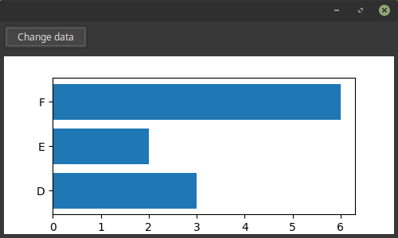

> -- Preview on Linux Mint 18.

# Developing

There are [extra steps](linux-prerequisites.md) required if you are on Linux - please follow those first.

```shell
pip install -r requirements-dev.txt
./watch
```

# Running tests

```shell
detox
```

# Running the project

```shell
python src/wxPython_matplotlib
```
